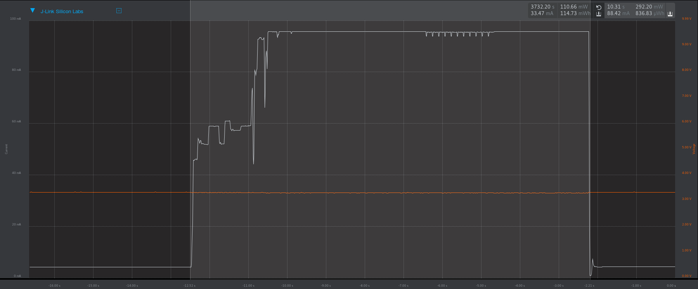

Power Consumption
=================
Setup used:

 - ESP32-CAM
   - AMS1117 3.3V regulator removed
 - OV2640 camera
 - Intenso SDHC 8 GB, Class 10
 - Silicon Labs BRD4001A development board with advanced Energy Monitor
 - Simplicity Studio™ SV4.1.11.3
 - ESP32-CAM_Interval, commit c4a7cde5f32acd85f7b9d302a003e4dc97b3cfb9
   - build options:
     - SLEEP: Enabled
     - GNSS:  Disabled
     - WIFI:  Disabled
   - configuration:
     - interval: 30 seconds
     - training shots: 10

The following values were measured:

 - Deep sleep:
   - Avg. Current: 4.0 mA
   - Avg. Power: 13.3 mW
 - Active:
   - duration: 10.3 Seconds
   - Avg. Current: 88 mA
   - Avg. Power: 292 mW
   - Total Power: 837 µWh

