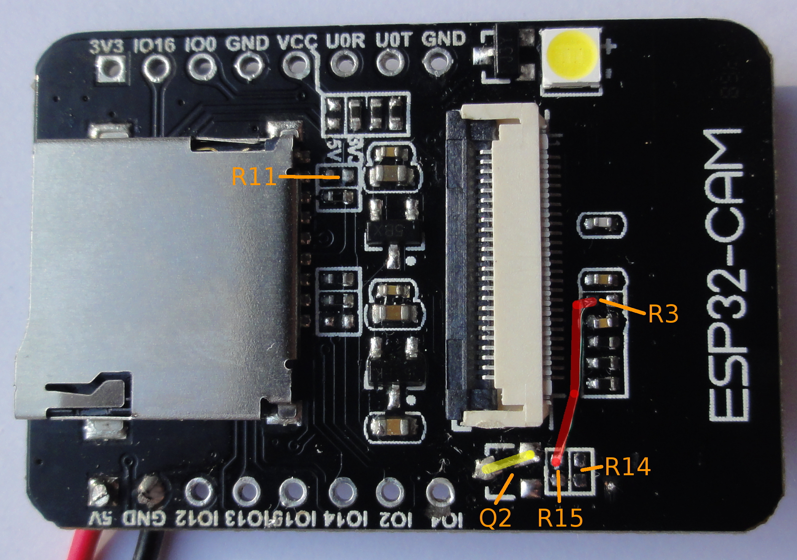

ESP32 sleep
===========
__TODO: Document__

Camera Power Down
=================
The ESP32-CAM board has a CAM_PWR pin to control the camera power rails.
However this does not switch the 3.3 Volt power to the camera. This means that
if the camera power is shut down through this pin the camera will enter a
partial shutdown state. This is probably not according to spec.

The correct way to put the camera in power down mode is to set the PWDN pin
high. However the PWDN pin on the ESP32-CAM board is not connected to the MCU
but pulled down with a 1k resistor, R3.

To be able to control the PWDN pin a modification to the PCB is needed. Below
two method are described. The new method is suggested. While the old method is
here for documentation since it was used for the test below.

PWDN PCB patch
--------------------------
In this patch the camera PWDN pin is connected to the CAM_PWR line, and Q2 is
removed. The switched 3.3 V is connected directly to the 3.3 V.

First remove R3, Q2, R15, and R14 from the PCB. Then bridge the two pads of Q2
closest to the CAM1 connector with a wire. Finally connect the pad of R3
closest to the CAM1 connector to the pad of R15 closest to the CAM1 connector.

For more details see this image:

Optionally R11 can also be removed to save an extra 0.07 mA. This is the
pull-up on the flash LED, which isn't necessary.

PWDN PCB patch, old method
--------------------------
First remove resistor R3 from the board. Now connect the pad of R3 closest to
the CAM1 connector with a wire to IO12 pin on header P2.

For more details see this image:

Since the GPIO12 pin is used for the 4-bit SD card bus, this means the
WITH_SD_4BIT compile option in config.h must be disabled.

Expected Power Consumption
==========================
Based on the data sheet of the different components the following standby
currents may be expected:

 - ESP32 deep-sleep, RTC wake-up: 0.010 mA
 - PSRAM(IPS6404), standby: 0.150 mA
 - Camera(OV2640), powerdown: 0.600 mA(Typ.) / 1.200 mA (Max.)
 - HS2_DATA1 pull-up: 3.3V/47K = 0.070 mA
 - CAM_PWR pull-up: 3.3V/(10k+1k) = 0.300 mA (only if volt. reg. enabled)
 - 1.2/2.8 V regulators: 2x 0.001 mA (Typ.) / 0.003 mA (Max.)
 - SD Card: 0.070 mA (measured, but differs per card)

Power Consumption Measurements
==============================
Below are the results of some measurements taken from the power consumption.

Setup used:

 - ESP32-CAM
   - AMS1117 3.3V regulator removed
   - R3 Removed
   - PWDN pin on CAM1 connector connected to IO12 on header P2
 - OV2640 camera
 - Intenso SDHC 8 GB, Class 10
 - Silicon Labs BRD4001A development board with Advanced Energy Monitor
   - ESP32-CAM 3.3 Volt connected to VMCU
 - Simplicity Studio™, SV4.1.11.3
 - ESP32-CAM_Interval firmware, commit 6deb415d285edde73a41de37b3737429c5e1e633
   - build options:
     - SLEEP: Enabled
     - GNSS:  Disabled
     - WIFI:  Disabled
     - WITH_CAM_PWDN & WITH_EVIL_CAM_PWR_SHUTDOWN dependend on test
   - configuration:
     - interval = 30000

Measurement is taken over a 5 minute interval. The values for the deep sleep
and active periods are averages from all these intervals within the
measurement.

The following configurations were tested:

 - Test 1: No camera power down
 - Test 2: WITH_CAM_PWDN enabled
 - Test 3: WITH_EVIL_CAM_PWR_SHUTDOWN enabled
 - Test 4: both WITH_CAM_PWDN and WITH_EVIL_CAM_PWR_SHUTDOWN enabled
 - Test 5: WITH_CAM_PWDN enabled, R14 changed to pull-down, and R11 removed

The test configuration in table form:

|   Test | WITH_CAM_PWDN | WITH_EVIL_CAM_PWR_SHUTDOWN |
| ------:|:-------------:|:--------------------------:|
| Test 1 |               |                            |
| Test 2 |       X       |                            |
| Test 3 |               |             X              |
| Test 4 |       X       |             X              |
| Test 5 |       X       |                            |

For test 5 some extra modifications were done to the PCB. First R11, the
pull-up on the HS2_DATA1 line, was removed. This because it conflicts with the
pull-down that is also on this line and only uses extra energy. Secondly the
R14 pull-up on the CAM-PWR line was changed into a pull-down. Since for this
test the CAM_PWR line is always kept low, and this pull-up uses about 0.3 mA.

# Overall
The averages and totals measured across the whole measurement duration.

|   Test | Duration (s) | Avg. Current (mA) | Avg. Power (mW) | Total Power (mWh) |
| ------ | ------------:| -----------------:| ---------------:| -----------------:|
| Test 1 |       298.40 |             36.91 |          122.19 |             10.13 |
| Test 2 |       298.20 |             21.71 |           71.75 |              5.94 |
| Test 3 |       298.00 |             23.81 |           78.74 |              9.32 |
| Test 4 |       298.20 |             21.24 |           70.19 |              8.31 |
| Test 5 |       298.60 |             21.22 |           70.17 |              5.82 |

NOTE: I have some doubts about the accuracy of SimplicityStudios calculation of
these numbers. Trying to measure the same interval twice gives different
numbers every time.

 - Test 1:
   
 - Test 2:
   
 - Test 3:
   
 - Test 4:
   
 - Test 5:
   

# Active Time
These are the averages of the average and total values of all active times
within the measurement. The number between parentheses in the standard deviation
of the individual active intervals.

|   Test | Duration (s) | Avg. Current (mA) | Avg. Power (mW) | Total Power (µWh) |
| ------ | ------------:| -----------------:| ---------------:| -----------------:|
| Test 1 |  7.04 (0.15) |      88.16 (0.73) |   291.24 (2.41) |    569.47 (15.95) |
| Test 2 |  7.32 (0.04) |      82.94 (0.48) |   273.99 (1.58) |    556.77 ( 2.90) |
| Test 3 |  7.27 (0.06) |      83.95 (0.49) |   277.34 (1.61) |    559.87 ( 4.32) |
| Test 4 |  7.47 (0.08) |      82.20 (0.30) |   271.54 (0.98) |    563.25 ( 6.53) |
| Test 5 |  7.34 (0.08) |      82.02 (0.56) |   271.15 (1.83) |    552.67 ( 7.97) |

# Deep Sleep Time

|    Test | Duration (s) | Avg. Current (mA) | Avg. Power (mW) | Total Power (µWh) |
| ------- | ------------:| -----------------:| ---------------:| -----------------:|
| Test 1L | 22.83 (0.17) |      20.13 (0.06) |    66.83 (0.21) |     423.87 (4.27) |
| Test 1H | 22.76 (0.20) |      24.93 (0.08) |    82.73 (0.28) |     523.03 (6.36) |
| Test 2  | 22.34 (0.08) |       1.79 (0.01) |     5.97 (0.01) |      37.02 (0.18) |
| Test 3  | 22.33 (0.10) |       4.02 (0.11) |    13.37 (0.35) |      82.92 (1.92) |
| Test 4  | 22.16 (0.08) |       1.53 (0.42) |     5.09 (1.39) |      31.32 (8.62) |
| Test 5  | 22.38 (0.11) |       1.41 (0.01) |     4.68 (0.02) |      29.09 (0.29) |

Notice that test1 is split into two parts. This is because two different
behaviours could clearly be identified.

Test 4 has the lowest average power consumption. However The average current is
far from stable. It fluctuates from 0.94 mA to 2.37 mA. In this specific test
there were a lot of intervals with low current draw. However in earlier test I
saw a lot of period with average currents around 2 mA.

# Conclusion
Test 5 shows that the lowest power consumption is achieved by using the PWDN
pin of the camera instead of switching the low voltage power rails. This also
generates a much more stable power consumption. And it is more according to
spec.

So if low power consumption is required it is suggested to modify the PCB
instead of using the CAM_PWR line provided on the vanilla PCB.

Further Research
================
Some things I haven't fully looked into that might be interresting to
investigate are described below.

Properly switching the camera power
-----------------------------------
A modification that could lower the power usage in sleep mode even more is to
connect the camera 3.3 Volt to the 3.3 V line switched by Q2. This way all
power to the camera is removed. All pull-up resistors on the camera I/O lines
also need to be connected to the switched 3.3 V to prevent powering the module
through the I/O lines.

I didn't try this but a short investigation into this suggested the following
can be done: The 3.3 V line needs to be cut just after R14 (or before if R14 is
removed). If I'm correct everything after R14 connected to this trace are
pull-up's to the camera I/O and the 3.3V pin of the camera. Only R19 is at the
opposite site of the board.

Note this does not remove the 0.150 mA standby consumption of the PSRAM.

SCCB software power-down
------------------------
The camera datasheet also describes a software initiated power down mode. This
could be useful in cases where you don't want to modify the PCB. It uses more
than hardware power down. But with 1-2 mA it uses a lot less than leaving the
camera on.

I think the proper way to implement this would be to add it to
esp32_camera_deinit() function.
